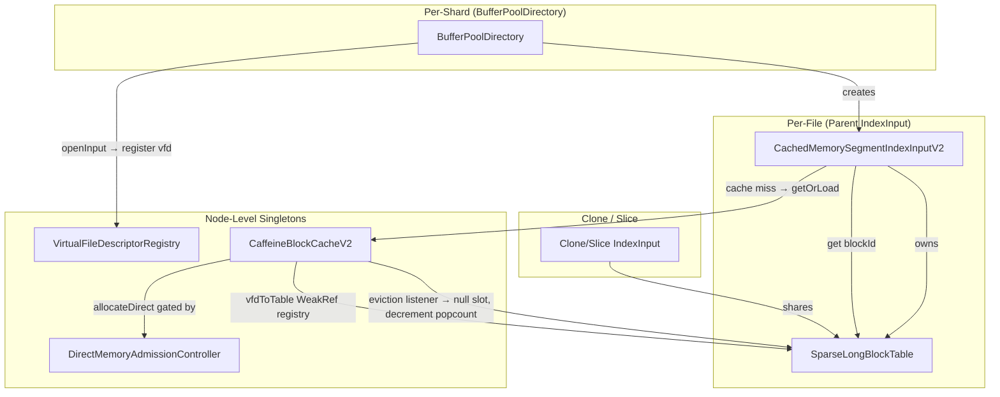
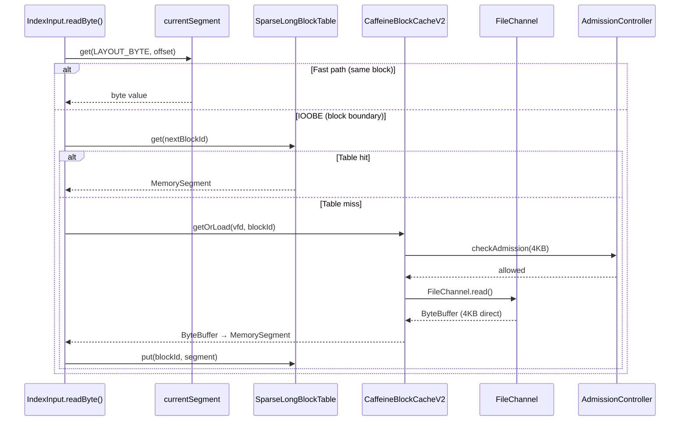
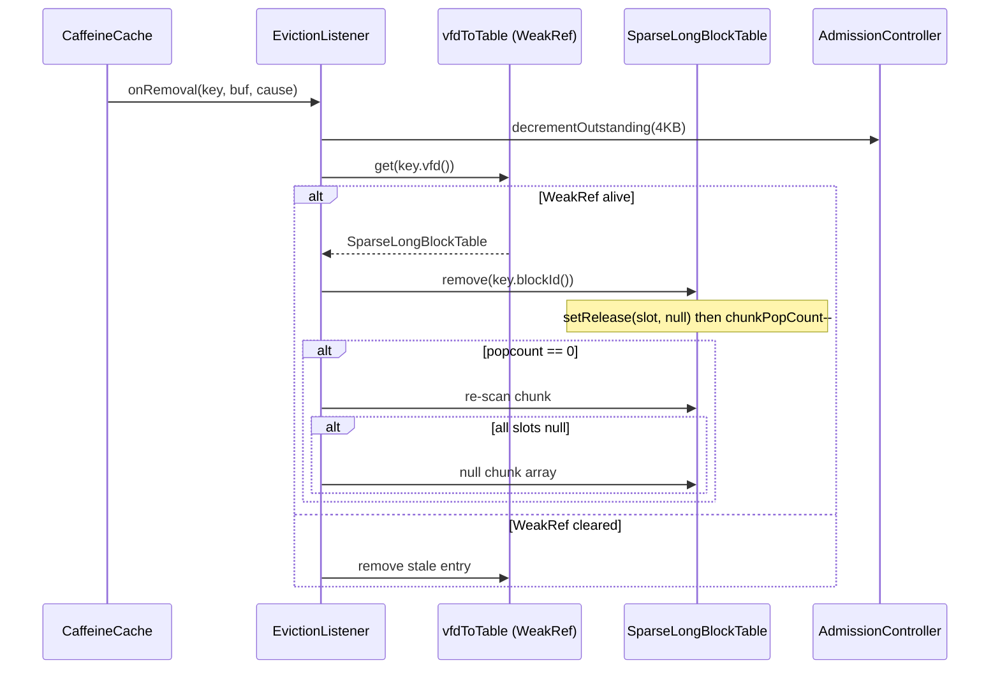

# Design Document: BufferPool V2 Memory Management

## Overview

This design describes the complete memory management redesign for the V2 block cache in OpenSearch's encrypted storage plugin. The redesign replaces String-based cache keys with integer vfd-based keys, eliminates the malloc-based MemorySegmentPool and reference counting in favor of ByteBuffer.allocateDirect with GC-based reclamation, removes BlockSlotTinyCache, and adds direct memory admission control. The SparseLongBlockTable is upgraded with VarHandle-based memory ordering, per-chunk AtomicInteger population counts, and re-scan-before-delete guards.

All changes target the existing block_cache_v2 and bufferpoolfs packages — no parallel class hierarchies are introduced.

### Key Design Decisions

| Decision | Rationale |
|---|---|
| 1:1 vfd↔SparseLongBlockTable (no path dedup) | Simplifies eviction listener cleanup; each parent IndexInput owns exactly one table |
| No Cleaner for clone/slice | Lucene guarantees clones/slices don't outlive parent |
| VarHandle setRelease/getAcquire for slot access | Prevents partially-initialized MemorySegment references on the read hot path |
| AtomicInteger chunkPopCount + re-scan guard | Prevents premature chunk deallocation from put/remove races |
| ByteBuffers never reused | GC collects after eviction; no stale data possible |
| DirectMemoryAdmissionController via AtomicLong | No syscall on hot path; periodic BufferPoolMXBean cross-check corrects drift |
| BlockCacheKeyV2 stores blockId (not blockOffset) | Eliminates repeated `>>> CACHE_BLOCK_SIZE_POWER` shift in eviction listener |

## Architecture




### Data Flow: Read Path



### Data Flow: Eviction Path



## Components and Interfaces

### 1. VirtualFileDescriptorRegistry (updated)

**Package:** org.opensearch.index.store.block_cache_v2
**Scope:** Node-level singleton

Changes from current implementation:
- Add overflow detection on AtomicInteger.getAndIncrement(). When the counter wraps past Integer.MAX_VALUE, throw IllegalStateException. At 100K shards × 80 segments × 100 files = 800M files, and with files being opened/closed over time, overflow is theoretically possible over very long node lifetimes.
- The overflow strategy is fail-fast: the system throws rather than silently producing duplicate vfds. A future enhancement could recycle vfds from closed entries, but for the initial implementation, fail-fast is safer and simpler.

```java
public int register(Path absolutePath) {
    String normalized = absolutePath.toAbsolutePath().normalize().toString();
    int vfd = nextVfd.getAndIncrement();
    if (vfd < 0) { // wrapped past Integer.MAX_VALUE
        throw new IllegalStateException("VFD counter overflow — node restart required");
    }
    vfdToPath.put(vfd, normalized);
    return vfd;
}
```


### 2. BlockCacheKeyV2 (updated — stores blockId, new hashCode)

**Package:** org.opensearch.index.store.block_cache_v2

**Key change: Store blockId instead of blockOffset.** The cache key uses `long blockId` (= fileOffset >>> CACHE_BLOCK_SIZE_POWER) rather than the raw byte offset. This eliminates the repeated right-shift in the eviction listener when converting blockOffset → blockId for SparseLongBlockTable lookup.

**hashCode change:** Replace Murmur-style hash with `vfd * 31 ^ Long.hashCode(blockId)`. This is simpler, well-distributed, and prevents clustering in Caffeine segments. `Long.hashCode(blockId)` already XORs high and low 32 bits. Multiplying vfd by 31 (a prime) before XOR ensures different vfds spread across segments — same pattern as `java.util.Arrays.hashCode`.

```java
public final class BlockCacheKeyV2 implements BlockCacheKey {
    private final int vfd;
    private final long blockId;  // was blockOffset — now pre-shifted

    public BlockCacheKeyV2(int vfd, long blockId) {
        this.vfd = vfd;
        this.blockId = blockId;
    }

    public int vfd() { return vfd; }
    public long blockId() { return blockId; }

    /** Reconstruct byte offset when needed (e.g., disk load). */
    public long blockOffset() { return blockId << StaticConfigs.CACHE_BLOCK_SIZE_POWER; }

    @Override
    public int hashCode() {
        return vfd * 31 ^ Long.hashCode(blockId);
    }

    @Override
    public boolean equals(Object o) {
        if (this == o) return true;
        if (!(o instanceof BlockCacheKeyV2 k)) return false;
        return vfd == k.vfd && blockId == k.blockId;
    }

    // BlockCacheKey interface — not used on hot path, only for compatibility
    @Override
    public Path filePath() {
        String path = VirtualFileDescriptorRegistry.getInstance().getPath(vfd);
        return path != null ? Path.of(path) : null;
    }

    @Override
    public long offset() { return blockOffset(); }

    @Override
    public String toString() {
        return "BlockCacheKeyV2{vfd=" + vfd + ", blockId=" + blockId + "}";
    }
}
```

**Eviction listener benefit:** The listener now does `table.remove(key.blockId())` directly — no `>>> CACHE_BLOCK_SIZE_POWER` shift needed.

### 3. SparseLongBlockTable (major update)

**Package:** org.opensearch.index.store.bufferpoolfs

Changes from current implementation:

| Aspect | Current | New |
|---|---|---|
| CHUNK_SHIFT | 8 (already 256) | 8 (unchanged) |
| Slot access | Plain array chunk[inner] | VarHandle setRelease/getAcquire |
| Chunk pop tracking | None | AtomicInteger[] chunkPopCounts parallel to directory |
| Chunk deallocation | Never | When popcount hits 0, re-scan then null |
| Directory field | volatile (already) | volatile (unchanged) |

**VarHandle setup:**

```java
private static final VarHandle SEGMENT_ARRAY_HANDLE =
    MethodHandles.arrayElementVarHandle(MemorySegment[].class);
```

**Slot read (get):**

```java
public MemorySegment get(long blockId) {
    int outer = (int)(blockId >>> CHUNK_SHIFT);
    int inner = (int)(blockId & CHUNK_MASK);
    MemorySegment[][] dir = directory; // volatile read
    if (outer >= dir.length) return null;
    MemorySegment[] chunk = dir[outer];
    if (chunk == null) return null;
    return (MemorySegment) SEGMENT_ARRAY_HANDLE.getAcquire(chunk, inner);
}
```

**Slot write (put):**

```java
public void put(long blockId, MemorySegment segment) {
    int outer = (int)(blockId >>> CHUNK_SHIFT);
    int inner = (int)(blockId & CHUNK_MASK);
    MemorySegment[][] dir = directory;
    if (outer >= dir.length || dir[outer] == null) {
        allocateChunk(outer);
        dir = directory;
    }
    MemorySegment prev = (MemorySegment) SEGMENT_ARRAY_HANDLE.getAcquire(dir[outer], inner);
    SEGMENT_ARRAY_HANDLE.setRelease(dir[outer], inner, segment);
    if (prev == null && segment != null) {
        chunkPopCounts[outer].incrementAndGet();
    }
}
```

**Slot remove (eviction listener):**

```java
public MemorySegment remove(long blockId) {
    int outer = (int)(blockId >>> CHUNK_SHIFT);
    int inner = (int)(blockId & CHUNK_MASK);
    MemorySegment[][] dir = directory;
    if (outer >= dir.length) return null;
    MemorySegment[] chunk = dir[outer];
    if (chunk == null) return null;
    MemorySegment prev = (MemorySegment) SEGMENT_ARRAY_HANDLE.getAcquire(chunk, inner);
    if (prev == null) return null;
    // Null slot FIRST, then decrement popcount
    SEGMENT_ARRAY_HANDLE.setRelease(chunk, inner, null);
    int remaining = chunkPopCounts[outer].decrementAndGet();
    if (remaining == 0) {
        reclaimChunkIfEmpty(outer);
    }
    return prev;
}
```

**Re-scan guard:**

```java
private void reclaimChunkIfEmpty(int outer) {
    MemorySegment[][] dir = directory;
    if (outer >= dir.length) return;
    MemorySegment[] chunk = dir[outer];
    if (chunk == null) return;
    for (int i = 0; i < CHUNK_SIZE; i++) {
        if (SEGMENT_ARRAY_HANDLE.getAcquire(chunk, i) != null) return;
    }
    // All slots confirmed null — safe to reclaim
    dir[outer] = null;
}
```

**allocateChunk (synchronized):** The allocateChunk method must also grow the chunkPopCounts array in lockstep with the directory. Both arrays are grown together under the same synchronized block.


### 4. CaffeineBlockCacheV2 (updated)

**Package:** org.opensearch.index.store.block_cache_v2

Changes:
- Integrate DirectMemoryAdmissionController into the block loading path
- Update eviction listener to: (1) decrement admission controller counter, (2) remove from table via `key.blockId()` directly (no shift needed), (3) opportunistically clean stale WeakReferences
- Block size changes from 32KB to 4KB (via StaticConfigs.overrideCacheBlockSize(12))

**Load path:**

```java
private ByteBuffer loadBlock(BlockCacheKeyV2 key) {
    admissionController.acquire(CACHE_BLOCK_SIZE); // may block at hard threshold
    try {
        String path = vfdRegistry.getPath(key.vfd());
        if (path == null) {
            throw new RuntimeException("No path registered for vfd=" + key.vfd());
        }
        ByteBuffer buf = ByteBuffer.allocateDirect(CACHE_BLOCK_SIZE);
        try (FileChannel ch = FileChannel.open(Path.of(path), StandardOpenOption.READ)) {
            long fileSize = ch.size();
            long offset = key.blockOffset(); // reconstructs from blockId
            int toRead = (int) Math.min(CACHE_BLOCK_SIZE, fileSize - offset);
            buf.limit(toRead);
            ch.position(offset);
            while (buf.hasRemaining()) {
                int n = ch.read(buf);
                if (n < 0) break;
            }
        }
        buf.flip();
        return buf;
    } catch (Exception e) {
        admissionController.release(CACHE_BLOCK_SIZE);
        throw (e instanceof RuntimeException re) ? re : new RuntimeException(e);
    }
}
```

**Eviction listener:**

```java
private void onRemoval(BlockCacheKeyV2 key, ByteBuffer value, RemovalCause cause) {
    if (key == null) return;
    admissionController.release(CACHE_BLOCK_SIZE);

    WeakReference<SparseLongBlockTable> ref = vfdToTable.get(key.vfd());
    if (ref == null) return;
    SparseLongBlockTable table = ref.get();
    if (table == null) {
        vfdToTable.remove(key.vfd()); // opportunistic cleanup
        return;
    }
    // blockId stored directly in key — no shift needed
    table.remove(key.blockId());
}
```

### 5. DirectMemoryAdmissionController (new)

**Package:** org.opensearch.index.store.block_cache_v2

A new class that gates ByteBuffer.allocateDirect() calls with soft/hard thresholds.

```java
public final class DirectMemoryAdmissionController {
    private final AtomicLong outstandingBytes = new AtomicLong(0);
    private final long maxDirectMemory;  // from -XX:MaxDirectMemorySize
    private final double softThreshold;  // default 0.85
    private final double hardThreshold;  // default 0.95
    private final long hardTimeoutMs;    // default 5000ms
    private final AtomicLong crossCheckCounter = new AtomicLong(0);
    private static final long CROSS_CHECK_INTERVAL = 1000; // every 1000 allocations

    public void acquire(int bytes) { ... }
    public void release(int bytes) { ... }
}
```

**acquire() logic:**
1. Increment outstandingBytes by bytes
2. Compute utilization = outstandingBytes / maxDirectMemory
3. If utilization > hardThreshold: block, call System.gc(), wait up to hardTimeoutMs for utilization to drop below hardThreshold. If timeout, throw DirectMemoryExhaustedException.
4. If utilization > softThreshold: call System.gc() asynchronously (non-blocking), proceed.
5. Periodically (every CROSS_CHECK_INTERVAL allocations), read BufferPoolMXBean and correct outstandingBytes if drift exceeds a tolerance.

**release() logic:**
1. Decrement outstandingBytes by bytes

### 6. CachedMemorySegmentIndexInputV2 (updated)

**Package:** org.opensearch.index.store.bufferpoolfs

Changes from current implementation:
- Replace Path-based FileBlockCacheKey with BlockCacheKeyV2(vfd, blockId)
- Remove ReadaheadManager/ReadaheadContext references (out of scope for this design)
- Remove BlockCacheValue<RefCountedMemorySegment> pin/unpin — replaced by direct ByteBuffer slices
- Remove BlockSlotTinyCache usage (already not present in V2, confirming removal)
- Add vfd field, integrate with VirtualFileDescriptorRegistry
- On parent close: blockTable.clear(), blockCache.deregisterTable(vfd), vfdRegistry.deregister(vfd)
- On clone/slice close: set currentSegment = null only

The existing DirectByteBufferIndexInput already implements most of this pattern. The final implementation will converge CachedMemorySegmentIndexInputV2 to use the same vfd-based approach as DirectByteBufferIndexInput.

### 7. BufferPoolDirectory (updated)

**Package:** org.opensearch.index.store.block_cache_v2 (as DirectBufferPoolDirectory)

Changes:
- openInput() registers vfd via VirtualFileDescriptorRegistry.getInstance().register(file)
- Creates SparseLongBlockTable per openInput() call, registers in vfdToTable
- Passes vfd + table to IndexInput constructor
- References node-level CaffeineBlockCacheV2 singleton

### 8. StaticConfigs (updated)

**Package:** org.opensearch.index.store.bufferpoolfs

Change default block size to 4KB:

```java
public static int CACHE_BLOCK_SIZE_POWER = 12; // 2^12 = 4KB
```

## Data Models

### BlockCacheKeyV2

```
┌─────────────────────────────────┐
│ BlockCacheKeyV2                 │
├─────────────────────────────────┤
│ int vfd          (4 bytes)      │
│ long blockId     (8 bytes)      │
├─────────────────────────────────┤
│ blockOffset(): blockId << POWER │
│ hashCode(): vfd*31 ^ Long.hash │
│ equals(): vfd && blockId        │
└─────────────────────────────────┘
```

### SparseLongBlockTable Memory Layout

```
directory (volatile MemorySegment[][])
  ├── [0] chunk → MemorySegment[256]  (2KB heap)
  │       ├── [0] → MemorySegment (via VarHandle getAcquire)
  │       ├── [1] → null
  │       └── ...
  ├── [1] null  (not yet allocated)
  ├── [2] chunk → MemorySegment[256]  (2KB heap)
  └── ...

chunkPopCounts (AtomicInteger[])
  ├── [0] → AtomicInteger(count of non-null in chunk[0])
  ├── [1] → null (chunk not allocated)
  ├── [2] → AtomicInteger(count of non-null in chunk[2])
  └── ...
```

**Scale calculation for 10GB file with 4KB blocks:**
- Total blocks: 10GB / 4KB = 2,621,440
- Outer indices: 2,621,440 / 256 = 10,240 chunks
- Directory array: 10,240 × 8 bytes (reference) = 80KB
- Fully populated chunks: 10,240 × 256 × 8 bytes = 20MB heap
- In practice, only accessed chunks are allocated (sparse)

### DirectMemoryAdmissionController State

```
┌──────────────────────────────────────┐
│ DirectMemoryAdmissionController      │
├──────────────────────────────────────┤
│ AtomicLong outstandingBytes          │
│ long maxDirectMemory                 │
│ double softThreshold (0.85)          │
│ double hardThreshold (0.95)          │
│ long hardTimeoutMs (5000)            │
│ AtomicLong crossCheckCounter         │
└──────────────────────────────────────┘
```

### VirtualFileDescriptorRegistry State

```
┌──────────────────────────────────────┐
│ VirtualFileDescriptorRegistry        │
├──────────────────────────────────────┤
│ AtomicInteger nextVfd (starts at 1)  │
│ ConcurrentHashMap<Integer, String>   │
│   vfdToPath                          │
├──────────────────────────────────────┤
│ register(Path) → int vfd            │
│   (overflow check: vfd < 0 → throw) │
│ deregister(int vfd)                  │
│ getPath(int vfd) → String            │
└──────────────────────────────────────┘
```


## Correctness Properties

### Property 1: VFD uniqueness under concurrent registration

*For any* N concurrent register() calls to VirtualFileDescriptorRegistry (possibly with duplicate file paths), all returned vfd values shall be distinct positive integers.

**Validates: Requirements 1.2, 1.3, 1.5, 1.6**

### Property 2: VFD register/deregister lifecycle

*For any* vfd obtained via register(path), after deregister(vfd) is called, getPath(vfd) shall return null, and the registry size shall not grow unboundedly across repeated register/deregister cycles.

**Validates: Requirements 1.4, 7.1, 7.2, 11.1, 11.4**

### Property 3: BlockCacheKeyV2 equals/hashCode contract

*For any* two BlockCacheKeyV2 instances a and b, a.equals(b) shall return true if and only if a.vfd() == b.vfd() and a.blockId() == b.blockId(). When a.equals(b) is true, a.hashCode() == b.hashCode() shall also be true. Constructing a key with (vfd, blockId) and reading back via accessors shall return the original values.

**Validates: Requirements 2.1, 2.2, 2.3**

### Property 4: SparseLongBlockTable put/get round trip

*For any* block ID and MemorySegment, after put(blockId, segment), get(blockId) shall return a non-null reference equal to the stored segment. This shall hold even when the block ID falls in a previously unallocated chunk (lazy allocation).

**Validates: Requirements 3.2, 9.3**

### Property 5: SparseLongBlockTable chunkPopCount accuracy

*For any* sequence of put() and remove() operations on a single chunk, the chunkPopCount shall equal the number of non-null entries in that chunk.

**Validates: Requirements 3.4**

### Property 6: Chunk deallocation after full eviction

*For any* chunk in SparseLongBlockTable, after all entries in that chunk are removed (via remove() or eviction listener), and the re-scan confirms all slots are null, the chunk array shall be nulled out (reclaiming ~2KB heap).

**Validates: Requirements 3.5, 5.3, 11.3**

### Property 7: VarHandle ordering — no partially initialized references

*For any* MemorySegment published via put() (using setRelease), a reader thread that observes a non-null reference via get() (using getAcquire) shall see the fully initialized MemorySegment with the expected sentinel data. No reader shall ever observe a partially constructed reference.

**Validates: Requirements 3.7, 3.14**

### Property 8: Concurrent put/get safety

*For any* N writer threads calling put() on overlapping block ID ranges while M reader threads call get() continuously, readers shall never observe a corrupted reference — only null or a valid MemorySegment.

**Validates: Requirements 3.15a**

### Property 9: Concurrent put/remove safety

*For any* N writer threads calling put() while M eviction threads call remove() on the same block IDs, after all threads complete, every slot shall be either null or a valid MemorySegment. No exceptions shall be thrown.

**Validates: Requirements 3.12, 3.15b**

### Property 10: Concurrent clear safety

*For any* scenario where one thread calls clear() while N reader threads call get() and M writer threads call put(), no thread shall throw an exception. Readers shall see either null or a valid MemorySegment.

**Validates: Requirements 3.13, 3.15c**

### Property 11: Concurrent chunk allocation — no lost writes

*For any* N threads concurrently triggering chunk allocation for the same outer index, exactly one chunk shall be allocated and all subsequent put/get operations on that chunk shall succeed.

**Validates: Requirements 3.15d**

### Property 12: Concurrent directory growth — no lost chunks

*For any* N threads concurrently triggering directory growth beyond the initial capacity, the directory shall grow correctly with no lost chunk references.

**Validates: Requirements 3.15e**

### Property 13: Sustained concurrency stress — no corruption

*For any* sustained concurrent workload of put/get/remove over 10 seconds with 32+ threads, no exceptions shall be thrown, no corrupted references shall be observed, and all MemorySegments shall be either valid or null at completion.

**Validates: Requirements 3.15f**

### Property 14: Cache returns read-only ByteBuffer slices

*For any* block loaded by CaffeineBlockCacheV2, the returned ByteBuffer shall be direct, read-only, and have a limit equal to the block size (or the remaining file bytes for the last block).

**Validates: Requirements 4.1, 4.3**

### Property 15: Eviction nulls table entry and triggers fallback

*For any* block evicted from CaffeineBlockCacheV2, the corresponding SparseLongBlockTable entry shall be null after eviction, and the next get() for that block ID shall return null (triggering a Caffeine fallback reload).

**Validates: Requirements 5.1, 5.2, 5.7, 11.2**

### Property 16: Stale WeakReference cleanup

*For any* eviction where the WeakReference for a vfd has been cleared, the eviction listener shall not throw an exception and shall opportunistically remove the stale entry from the vfdToTable registry.

**Validates: Requirements 5.4, 5.5**

### Property 17: Reader safety after eviction

*For any* reader thread that obtains a MemorySegment reference before Caffeine evicts the corresponding block, the reader shall safely complete its read with correct data because the MemorySegment keeps the underlying ByteBuffer reachable.

**Validates: Requirements 5.6**

### Property 18: Sequential read correctness across block boundaries

*For any* file of arbitrary size, reading all bytes sequentially via readByte() shall produce the same byte sequence as reading the file directly from disk. Block boundary crossings (IOOBE) and cold starts (NPE) shall be handled transparently.

**Validates: Requirements 6.1, 6.2, 6.3**

### Property 19: Random access read correctness

*For any* valid position within a file, readByte(pos) shall return the same byte as reading that position directly from disk. Cache misses shall trigger Caffeine loads and populate the SparseLongBlockTable.

**Validates: Requirements 6.5, 6.6, 9.3**

### Property 20: Clone close does not affect parent

*For any* parent IndexInput with active clones, closing a clone shall set its currentSegment to null but shall not affect the parent's ability to read data.

**Validates: Requirements 7.3**

### Property 21: Idempotent close

*For any* IndexInput (parent, clone, or slice), calling close() multiple times shall not throw an exception.

**Validates: Requirements 7.4**

### Property 22: Admission controller counter accuracy

*For any* sequence of acquire(n) and release(n) calls to DirectMemoryAdmissionController, the outstanding bytes counter shall equal the sum of all acquired bytes minus all released bytes.

**Validates: Requirements 8.2, 8.3**

### Property 23: Soft threshold allows allocation

*For any* state where direct memory utilization is between the soft threshold and hard threshold, acquire() shall succeed without blocking (the allocation proceeds after requesting async GC).

**Validates: Requirements 8.5**

### Property 24: Hard threshold blocks allocation

*For any* state where direct memory utilization exceeds the hard threshold, acquire() shall block the calling thread until utilization drops below the hard threshold or the timeout expires.

**Validates: Requirements 8.6**

### Property 25: No OOM under admission-controlled churn

*For any* workload that churns direct ByteBuffers through CaffeineBlockCacheV2 under a constrained MaxDirectMemorySize, the DirectMemoryAdmissionController shall prevent OutOfMemoryError by gating allocations.

**Validates: Requirements 11.5, 12.1, 12.2**


## Error Handling

### VirtualFileDescriptorRegistry

| Error Condition | Handling |
|---|---|
| AtomicInteger overflow (vfd < 0) | Throw IllegalStateException("VFD counter overflow"). Fail-fast; node restart required. |
| getPath() for unknown vfd | Return null. Caller (cache loader) throws RuntimeException("No path registered"). |
| Concurrent register/deregister | ConcurrentHashMap handles thread safety. No additional error handling needed. |

### CaffeineBlockCacheV2

| Error Condition | Handling |
|---|---|
| FileChannel.read() IOException | Wrapped in RuntimeException with context (blockId, path). Caffeine propagates to caller. |
| Admission controller rejects allocation | DirectMemoryExhaustedException propagated to caller as IOException. |
| Eviction listener encounters null key | Early return (defensive null check). |
| Eviction listener encounters cleared WeakRef | Skip cleanup, opportunistically remove stale entry. No exception. |

### SparseLongBlockTable

| Error Condition | Handling |
|---|---|
| get() with blockId beyond directory | Return null (triggers Caffeine fallback). No exception. |
| remove() with blockId beyond directory | Return null. No exception. |
| put() with blockId beyond directory | Trigger allocateChunk() which grows directory under synchronized block. |
| chunkPopCount underflow (below 0) | Should not happen with correct implementation. If it does, the re-scan guard prevents incorrect chunk deallocation. |

### DirectMemoryAdmissionController

| Error Condition | Handling |
|---|---|
| Hard threshold exceeded, GC timeout | Throw DirectMemoryExhaustedException with utilization details. |
| BufferPoolMXBean cross-check drift | Correct outstandingBytes silently. Log warning if drift exceeds 10%. |
| release() called more times than acquire() | Counter goes negative. Corrected on next cross-check. Log warning. |

### CachedMemorySegmentIndexInputV2

| Error Condition | Handling |
|---|---|
| Read past EOF | Throw EOFException. |
| Read on closed input | Throw AlreadyClosedException. |
| Seek to negative position | Throw IllegalArgumentException. |
| Seek past EOF | Throw EOFException. |
| Block load failure | Propagate IOException from CaffeineBlockCacheV2. |
| Slice with invalid bounds | Throw IllegalArgumentException. |

## Testing Strategy

### Property-Based Testing Library

The project uses Java with Gradle. Property-based tests shall use **jqwik** (net.jqwik:jqwik:1.9.+) as the PBT library. jqwik integrates with JUnit 5 and provides @Property, @ForAll, and custom Arbitrary generators.

Each property test must:
- Run a minimum of 100 iterations (configured via @Property(tries = 100) or higher)
- Reference the design property via a tag comment: `// Feature: bufferpool-v2-memory-management, Property N: <title>`
- Be implemented as a single @Property-annotated method per correctness property

### Unit Tests

Unit tests complement property tests by covering:
- Specific examples: singleton behavior (Req 1.1), block size constants (Req 10.1, 10.4)
- Edge cases: VFD overflow detection (Req 1.7), 10GB file max block ID (Req 3.3, 10.2, 10.3), EOF on read past end (Req 6.4), hard threshold timeout exception (Req 8.7), cleared WeakReference during eviction (Req 5.4)
- Integration: admission control disabled failure mode documentation (Req 12.3), JVM flag requirement (Req 12.4)

Unit tests use JUnit 5 (@Test). Keep unit test count minimal — property tests handle broad input coverage.

### Test Organization

```
src/test/java/org/opensearch/index/store/
├── block_cache_v2/
│   ├── VirtualFileDescriptorRegistryPropertyTest.java   (Properties 1, 2)
│   ├── VirtualFileDescriptorRegistryTest.java           (singleton, overflow edge case)
│   ├── BlockCacheKeyV2PropertyTest.java                 (Property 3)
│   ├── CaffeineBlockCacheV2PropertyTest.java            (Properties 14, 15, 16, 17)
│   ├── CaffeineBlockCacheV2Test.java                    (eviction edge cases)
│   ├── DirectMemoryAdmissionControllerPropertyTest.java (Properties 22, 23, 24, 25)
│   └── DirectMemoryAdmissionControllerTest.java         (timeout exception edge case)
├── bufferpoolfs/
│   ├── SparseLongBlockTablePropertyTest.java            (Properties 4, 5, 6, 7)
│   ├── SparseLongBlockTableConcurrencyTest.java         (Properties 8, 9, 10, 11, 12, 13)
│   └── SparseLongBlockTableTest.java                    (max block ID edge case)
└── integration/
    ├── IndexInputPropertyTest.java                      (Properties 18, 19, 20, 21)
    └── AdmissionControlStressTest.java                  (Property 25, Reqs 12.1-12.4)
```

### Concurrency Test Approach

SparseLongBlockTable concurrency tests (Properties 8–13) use CountDownLatch for synchronized thread start and ExecutorService with 32+ threads. Each test:
1. Creates a shared SparseLongBlockTable
2. Launches N writer + M reader/remover threads behind a latch
3. Runs for a fixed duration or iteration count
4. Joins all threads and asserts: no exceptions, all slots are null or valid MemorySegments

### Admission Control Stress Tests

Tests for Property 25 and Requirements 12.1–12.4 must run with `-XX:MaxDirectMemorySize=32m` JVM flag (configured in build.gradle test task). They churn data through a small Caffeine cache and verify no OutOfMemoryError is thrown.
